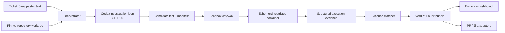

# BugAgent — High-Level Design

## Product thesis

Bug triage has a costly gap between a textual report and a developer-usable proof. Maintainers spend time reproducing reports, rebuilding environments, and distinguishing product defects from setup errors. BugAgent is an evidence-to-PR agent: it converts a ticket into a deterministic failing test plus an audit bundle, or returns a bounded and useful inconclusive result.

The product promise is not “AI decides whether a bug is real.” It is: **every affirmative verdict ships with a replayable proof.**

## Target user and job

**Primary user:** a software engineer or triage lead handling Jira/GitHub issues in a Python service or library.

**Job:** “Before I interrupt an engineer, tell me whether this report can be reproduced at a pinned commit, show the exact proof, and make it safe to verify.”

## Category and differentiation

Submit as **Developer Tools**. The differentiated artifact is a *Reproduction PR*:

| Conventional bug agent | BugAgent |
|---|---|
| Chat answer or proposed patch | Versioned failing test and replay recipe |
| Model-stated confidence | Evidence-derived confidence with reasons |
| One opaque sandbox run | Clean-run replay plus audit timeline |
| “Cannot reproduce” conclusion | `NOT_REPRODUCED` or `NEED_INFO`, scoped to attempts |

## User experience

1. A user selects a repository revision and pastes/imports a bug ticket.
2. The **Investigation Timeline** streams the evidence: ticket facts extracted, environment detected, hypotheses, test attempts, sandbox result, and match assessment.
3. The **Evidence Card** presents a single verdict, confidence band, expected-versus-observed symptom, and the exact failing test.
4. For a reproduced issue, the user clicks **Create reproduction PR** or **Post evidence to Jira**. For inconclusive runs, they copy targeted questions or retry with added information.
5. Anyone can use the generated `bugagent replay <run-id>` command to recreate the proof from the pinned commit.

## System architecture

## Core capabilities

### 1. Evidence-first investigation

Codex uses GPT-5.6 to inspect the ticket and repository through constrained tools: search, read files, inspect tests, write a candidate test, and evaluate structured sandbox feedback. It never declares a reproduction directly; only the verifier can do that.

### 2. Deterministic verification

Every candidate is run in a fresh, network-disabled sandbox. A positive candidate must pass a preflight check, fail for the expected reason, and reproduce on two clean executions before BugAgent labels it `REPRODUCED`.

### 3. Reviewable proof bundle

The bundle includes the test diff, a lockfile/environment fingerprint, normalized stack trace, command log, SHA-256 artifact hashes, evidence score, and replay command. It is retained locally for the demo and can be attached to a pull request.

### 4. Honest uncertainty

Statuses are intentionally precise:

- `REPRODUCED`: two clean runs match the ticket’s symptom and relevant code path.
- `NOT_REPRODUCED`: bounded hypotheses ran in valid environments but did not produce matching evidence.
- `NEED_INFO`: ticket is missing a blocking input such as version, credentials, expected behavior, or reproduction sequence.
- `INCONCLUSIVE`: setup, timeout, safety policy, or unsupported stack prevented a valid investigation.

## Safety and trust boundaries

Repository code and model-generated tests are untrusted. Containers run with no network, a read-only root filesystem, a non-root user, dropped Linux capabilities, a temporary writable working directory, CPU/memory/PID limits, a wall-clock timeout, and a command allowlist. Secrets are not mounted. The agent cannot access the host Docker socket, credentials, or arbitrary host paths.

The MVP supports pinned Python repositories with `pytest`; unsupported languages fail safely with an explanation. That constraint makes the demo trustworthy rather than broad but fragile.

## Why Codex is essential

The work requires repository-scale engineering: following code paths, understanding existing test conventions, selecting public APIs, writing idiomatic tests, interpreting failed setup, and iterating with execution feedback. Codex performs that agentic work; deterministic sandbox verification and scoring keep it accountable. The submission will include the required Codex feedback session ID and a brief build log showing where Codex accelerated implementation and investigation.

## MVP scope

Build the complete vertical slice for local repositories and pasted tickets, with an evidence dashboard, a local sandbox, and a “create patch” artifact. Jira/GitHub posting is an adapter, not a prerequisite. Do not build auto-fix.

## Success metrics

- Reproduction precision: fraction of `REPRODUCED` verdicts whose test replays twice in clean containers.
- Evidence completeness: fraction of runs containing all required bundle fields.
- Triage usefulness: human reviewer rating that the output is actionable.
- Time-to-proof: median time from ticket to evidence bundle.

The demo reports these metrics on a frozen evaluation set rather than presenting anecdotes as accuracy claims.
