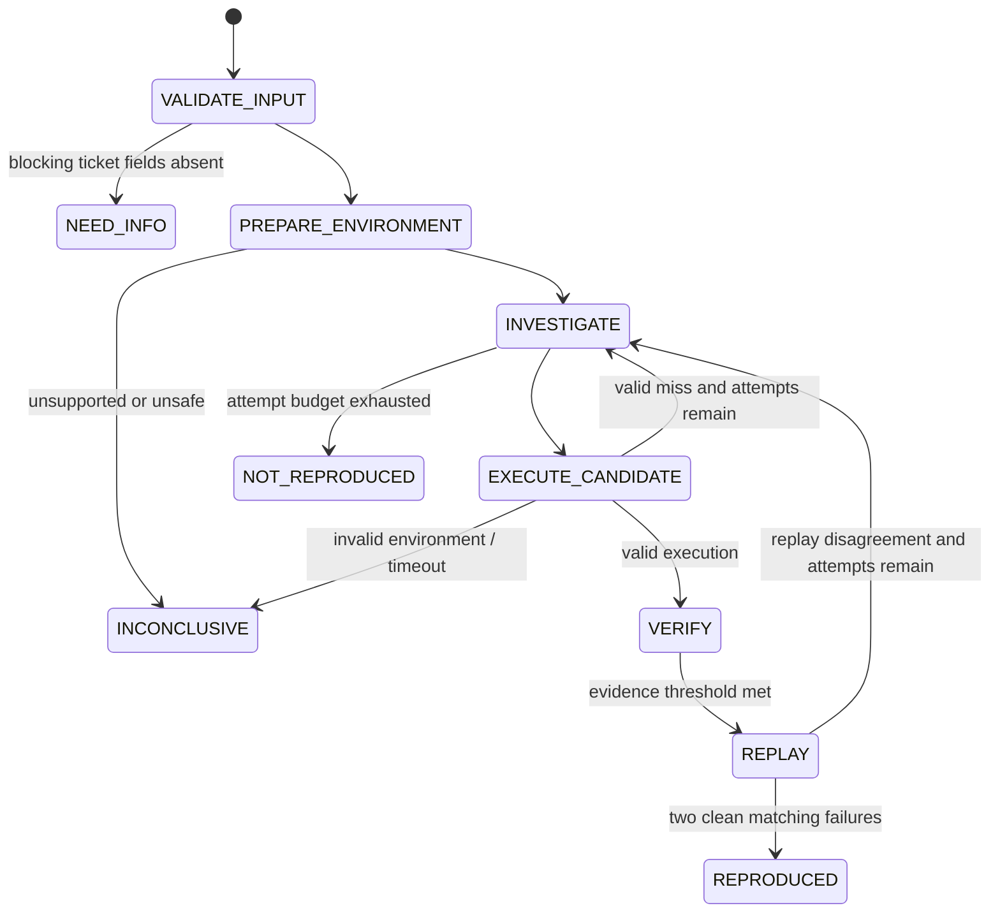

# BugAgent — Low-Level Design

## Supported MVP contract

Input is a bug report and a local Git repository at a user-selected commit. The MVP supports Python projects that can run under `pytest`. Output is an immutable `RunBundle` stored under `.bugagent/runs/<run_id>`.

## Modules

```text
bugagent/
  api/                 # FastAPI routes, SSE investigation stream
  domain/              # typed ticket, evidence, verdict models
  orchestration/       # finite-state investigation controller
  codex/               # constrained Codex tool adapter and prompts
  repo/                # git worktree creation, stack detection, manifest
  sandbox/             # policy, Docker implementation, result parser
  verification/        # preflight, matcher, replay verifier, scoring
  artifacts/           # atomic bundle writer, hashes, PR patch writer
  integrations/        # Jira/GitHub adapters (optional)
  ui/                  # evidence dashboard
  fixtures/            # frozen evaluation repos and tickets
```

## Domain models

```python
class Ticket(BaseModel):
    id: str
    title: str
    body: str
    source_url: HttpUrl | None = None
    repo_ref: str
    expected_error: str | None = None
    version_hint: str | None = None

class CandidateTest(BaseModel):
    path: str
    content: str
    hypothesis: str
    expected_symptom: str
    public_api_claim: list[str]

class ExecutionEvidence(BaseModel):
    attempt: int
    command: list[str]
    exit_code: int | None
    timed_out: bool
    setup_valid: bool
    test_collected: bool
    test_failed: bool
    normalized_trace: str | None
    stdout_sha256: str
    stderr_sha256: str
    environment_fingerprint: dict[str, str]

class Verdict(BaseModel):
    status: Literal['REPRODUCED', 'NOT_REPRODUCED', 'NEED_INFO', 'INCONCLUSIVE']
    confidence: Literal['high', 'medium', 'low']
    evidence_score: int  # 0..100, deterministic formula
    rationale: list[str]
    blocking_questions: list[str] = []

class RunBundle(BaseModel):
    run_id: UUID
    ticket: Ticket
    repo_commit: str
    prompt_version: str
    candidates: list[CandidateTest]
    evidence: list[ExecutionEvidence]
    verdict: Verdict
    artifact_hashes: dict[str, str]
```

## Investigation state machine



Only `REPLAY` may emit `REPRODUCED`. Attempts are capped at three candidate tests, then two replay runs for the winning candidate. Each state transition is appended to the run event log and published to the UI by SSE.

## Codex adapter

The adapter gives Codex a narrow tool surface:

- `repo.search(query)`, `repo.read(path)`, `repo.list_tests()`
- `repo.get_manifest()` — pinned commit, Python version, dependency files, detected test command
- `candidate.write(path, content, hypothesis, expected_symptom)` — validates path and size
- `execution.read(attempt)` — structured results only

System constraints: write a single pytest test using public APIs where possible; do not modify application code; never include secrets; state uncertainty; return structured fields. Prompts are versioned and saved in the bundle. The adapter prevents direct shell access and writes only beneath `tests/bugagent_generated/` in the temporary worktree.

## Sandbox execution

1. Create a disposable Git worktree at the requested immutable commit.
2. Detect a supported environment from `pyproject.toml`, `requirements*.txt`, or a fixture manifest.
3. Build/use a pinned image, install declared dependencies, and record versions.
4. Mount the prepared worktree read-only and the generated test in a dedicated writable overlay.
5. Run preflight collection: `pytest --collect-only <test>`.
6. Run the candidate once. Capture capped stdout/stderr and normalize absolute paths.
7. Remove the container and worktree on completion.

Sandbox policy is enforced in `SandboxPolicy`; policy violations produce `INCONCLUSIVE`, not a retry. Output is capped at 256 KB per stream and artifacts at 2 MB.

## Evidence matcher

`EvidenceMatcher` is deterministic and does not ask the model for confidence. It awards:

| Signal | Points |
|---|---:|
| Test collects and setup is valid | 20 |
| Test fails (not errors during collection/setup) | 20 |
| Expected exception or assertion symptom matches | 25 |
| Relevant repository frame / API path matches ticket hypothesis | 20 |
| Candidate uses claimed public API | 5 |
| Two clean replay failures have equivalent normalized signatures | 10 |

`REPRODUCED` requires 85+ points and no disqualifier. Disqualifiers include missing imports, dependency failures, timeout, prohibited file access, test failure solely in generated code, or differing replay signatures. The dashboard shows each signal and disqualifier.

## Artifact and replay format

```text
.bugagent/runs/<run-id>/
  manifest.json          # schema version, commit, image digest, hashes
  ticket.json
  timeline.ndjson
  candidate_01.py
  evidence_01.json
  replay_01.json
  normalized-trace.txt
  reproduction.patch
  REPLAY.md
```

Writes use a temporary directory followed by an atomic rename. `REPLAY.md` contains one copy-paste command and expected normalized signature. The PR patch includes only the failing test plus a generated `BUGAGENT_EVIDENCE.md`; no production code changes.

## API and UI

- `POST /runs` accepts `Ticket` and repository root/ref.
- `GET /runs/{id}` returns the immutable `RunBundle`.
- `GET /runs/{id}/events` streams timeline events by SSE.
- `GET /runs/{id}/artifact/{name}` serves whitelisted artifact files.
- `POST /runs/{id}/replay` starts a clean verifier run.

The dashboard has four non-chat surfaces: intake, live timeline, evidence card, and artifact/replay panel. Empty states explain supported scope. A red “inconclusive” state is a first-class outcome, never hidden behind a low confidence score.

## Test strategy

Unit tests cover state transitions, matcher scoring/disqualifiers, artifact hashes, and policy validation. Integration tests use frozen fixture repositories. End-to-end tests run one known reproduction and one `NEED_INFO` ticket. A regression fixture is added for every observed false positive.
