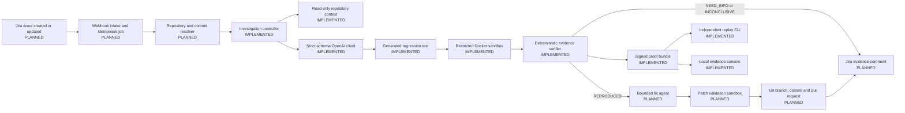

# BugAgent architecture

## Purpose and scope

BugAgent is designed to turn a Jira bug report into evidence that a maintainer can trust, then—only after verified reproduction—attempt a bounded code repair and offer it as a pull request. The current codebase implements the local reproduction, verification, replay, and review path. The Jira, repair, and pull-request adapters below are target components and are explicitly marked as planned.

## Implemented components

| Component | Responsibility | Code |
|---|---|---|
| Domain model | Tickets, candidates, execution evidence, verdicts, run events, and bundles | [`bugagent/domain.py`](../bugagent/domain.py) |
| Investigation controller | Limits candidate attempts, makes a disposable worktree, runs candidate plus replays, emits a verdict | [`bugagent/agent/orchestrator.py`](../bugagent/agent/orchestrator.py) |
| Repository boundary | Provides bounded source snippets while excluding secrets and unsafe paths | [`bugagent/agent/repository.py`](../bugagent/agent/repository.py) |
| Model adapter | Uses the OpenAI Responses API with strict JSON schema output | [`bugagent/agent/client.py`](../bugagent/agent/client.py) |
| Sandbox policy and runner | Constructs restricted Docker commands and executes pytest collection plus test execution | [`bugagent/sandbox/policy.py`](../bugagent/sandbox/policy.py), [`bugagent/sandbox/docker.py`](../bugagent/sandbox/docker.py) |
| Evidence verifier | Applies deterministic scoring and makes positive verdicts conditional on two agreeing replays | [`bugagent/scoring.py`](../bugagent/scoring.py) |
| Artifact store | Writes candidate, evidence, verdict, timeline, and SHA-256 manifest atomically | [`bugagent/artifacts.py`](../bugagent/artifacts.py) |
| Replay verifier | Validates a bundle manifest, copies the repository, and runs two fresh replays | [`bugagent/replay.py`](../bugagent/replay.py) |
| Evidence console | Serves local read-only bundle APIs and static review UI | [`bugagent/web.py`](../bugagent/web.py), [`web/app.js`](../web/app.js) |

## Target Jira-to-PR architecture

### 1. Intake and job control - planned

A Jira webhook handler must verify the webhook signature, normalize the issue into the existing `Ticket` shape, select a repository/commit through an explicit mapping, and write an idempotent job record before any model or sandbox work starts. Repeated Jira events should resolve to the same active job, rather than duplicate a PR or comment.

Suggested job states: `RECEIVED`, `NEED_INFO`, `INVESTIGATING`, `REPRODUCED`, `FIXING`, `FIX_VALIDATED`, `PR_OPEN`, `INCONCLUSIVE`, `FAILED`.

### 2. Reproduction - implemented core, planned adapter

The existing controller accepts a normalized `Ticket`, local repository path, and commit label. The Jira adapter will supply these inputs. It must post one concise Jira comment after the verdict, using the immutable run ID as the audit link.

### 3. Fix loop - planned

Fixing must be a separate capability from reproduction. It needs a strict patch schema, a bounded number of candidate diffs, and a disposable worktree. The acceptance gate is:

1. The verified regression test fails before the patch.
2. That same test passes after the patch.
3. The configured relevant test suite passes after the patch.
4. The resulting diff is within an allowlisted file/size scope and contains no secret or dependency lockfile changes unless explicitly allowed.
5. A fresh sandbox rerun agrees with the accepted result.

Only the accepted patch can proceed to Git operations.

### 4. Git provider and Jira writeback - planned

The Git provider adapter should receive only a validated diff, create a dedicated branch, commit the change, create a PR, and return the PR URL. The Jira adapter should then add a comment containing the reproduction status, test path, evidence score, run ID, and PR URL. A Jira workflow transition is optional and must be configurable per project.

## Security boundaries

| Boundary | Rule |
|---|---|
| Jira ingress | Verify webhook signature, accept allowlisted projects only, and persist an idempotency key. |
| Repository access | Resolve only mapped repositories and pinned commits; do not let ticket text choose arbitrary local paths. |
| Model context | Exclude secret-like paths, cap file and context size, and forbid arbitrary tools. |
| Generated test | Restrict to `tests/bugagent_generated/test_*.py`; reject subprocess, networking, `open()`, and similar operations. |
| Sandbox | No network, read-only root filesystem, non-root user, dropped Linux capabilities, CPU/memory/PID limits, output cap, and timeout. |
| Patch generation | Work only in a disposable checkout; validate diff scope before sandbox execution. |
| Git and Jira credentials | Use separate least-privilege identities. The sandbox never receives either credential. |
| External write actions | Create Jira comments and PRs only after an auditable verified result; support an approval gate before PR creation. |

## Data and audit trail

An investigation bundle contains the normalized ticket, generated candidate test, each execution record, verdict, timeline, and a manifest of SHA-256 hashes. It is written atomically under `.bugagent/<run-id>/`. The replay command checks those hashes before execution and uses a temporary copy of the provided repository, so review never changes the original checkout.

The target production job record should add: Jira issue ID, webhook event ID, repository URL, full commit SHA, model and prompt version, sandbox image digest, current state, actor identity, retry count, Jira comment IDs, branch name, PR URL, and approval decisions.
