# DevSleuthAgent architecture

## The one-sentence model

DevSleuthAgent is an **evidence-gated change pipeline**: it turns a Jira bug report into a reproducible, independently replayed failure; only then can it produce a small source patch, prove that patch in an isolated sandbox, open a **draft** GitHub pull request, and link the result back to Jira.

The important distinction is that GPT-5.6 proposes a test and (later) a patch, but it never decides that a bug is real and it never decides that a fix is safe. Those decisions are made by deterministic validation, sandbox execution, replays, and the scoring rubric.

## What is live today vs. production-scale extensions

Everything in the solid path below exists in this repository and has been exercised with the Mercato demo project. The muted control-plane items are the architecture we would add to operate this across many teams; they are not represented as already deployed capabilities.

```mermaid
flowchart LR
    subgraph Input[1. Intake]
        U["Developer / DevSleuth UI"]
        J["Jira Cloud\nissue_created webhook"]
        G["Webhook-only gateway\npublic tunnel -> loopback"]
        U --> API
        J --> G --> API
    end

    subgraph Control[2. Local service and job control]
        API["FastAPI service\n127.0.0.1:8001"]
        JR["Thread-safe job registries\nstatus + progress events"]
        UI["DevSleuthAgent web workspace\nActivity, evidence, history"]
        API <--> JR
        API --> UI
    end

    subgraph Evidence[3. Evidence plane]
        SRC["Source resolver\nlocal path OR allow-listed GitHub ref"]
        PIN["Disposable checkout\nfull commit SHA pinned"]
        CTX["Read-only bounded source context"]
        LLM["GPT-5.6 Responses API\nstrict JSON, store:false"]
        TEST["Safety-validated generated test\ntests/bugagent_generated only"]
        BOX["Restricted Docker pytest sandbox\ncollect + execute + 2 replays"]
        SCORE["Deterministic rubric\nREPRODUCED only with proof"]
        BUNDLE["Immutable evidence bundle\nSHA-256 manifest + timeline"]
        SRC --> PIN --> CTX --> LLM --> TEST --> BOX --> SCORE --> BUNDLE
    end

    subgraph Change[4. Change plane: only after REPRODUCED]
        FIXLLM["GPT-5.6 fix client\nstrict unified diff"]
        VALIDATE["Disposable patch validator\nbefore fail -> after pass -> suite pass"]
        PLAN["Persisted local PR plan\ndiff + regression test + pinned base"]
        PUB["Explicit publish or YOLO\nbranch + commit + GitHub draft PR"]
        FIXLLM --> VALIDATE --> PLAN --> PUB
    end

    API --> SRC
    BUNDLE --> API
    SCORE -->|"REPRODUCED"| FIXLLM
    SCORE -->|"NOT_REPRODUCED / INCONCLUSIVE / NEED_INFO"| JC["Evidence comment in Jira"]
    PUB --> PR["GitHub Draft PR"]
    PUB --> PC["PR-link comment in Jira"]

    subgraph Future[Production control plane — not yet deployed]
        Q["Durable queue and job database"]
        OBS["Central logs, metrics, traces, alerts"]
        IAM["SSO/RBAC, approval policy, secret manager"]
        POL["Repo/project policy and audit retention"]
    end
```



## The three planes

Thinking in three planes makes the design easy to follow.

| Plane | Question it answers | Main components | What it may change |
|---|---|---|---|
| **Control plane** | Who asked for work, what is running, and what can the user see? | FastAPI, UI, job registries, Server-Sent Events (SSE), Jira gateway | Only in-memory job state and local demo history when explicitly cleared. |
| **Evidence plane** | Is this a real product defect at an exact source revision? | Repository resolver, read-only context, GPT-5.6 test proposal, sandbox, replay, scorer, artifacts | Never changes the original checkout or remote repository. All candidate work happens in disposable copies. |
| **Change plane** | Is there a minimal patch that demonstrably fixes the proven defect? | GPT-5.6 patch proposal, patch validator, PR plan, publisher | A temporary validation copy first. GitHub changes happen only for an approved/YOLO-enabled, already-validated draft PR. |

That separation is deliberate. A model failure in one plane cannot bypass the safety gate of another plane.

---

## 1. Entry points and ingress

### Web workspace

`ui/index.html`, `ui/app.js`, and `ui/styles.css` are served by the FastAPI application at `/app/`.

The workspace supports:

- **New Investigation** — manually submit a ticket plus either a local checkout or an allow-listed GitHub repository/ref.
- **Activity** — see manual and Jira-originated jobs, their current stage, elapsed time, and errors.
- **Evidence** — inspect the generated test, sandbox facts, replay results, score, rationale, and post-reproduction status.
- **History** — read persisted bundles. A run that reached the change plane is labelled `FIX VALIDATED` or `DRAFT PR OPEN`, rather than being left at merely `REPRODUCED`.
- **Manual control** — prepare a fix and publish a validated PR as separate deliberate actions.
- **YOLO mode** — an explicit, runtime-local opt-in that allows *future Jira tickets* to continue automatically from verified reproduction through a draft PR. It resets off when the API restarts.

The UI first consumes retained SSE progress events and also polls as a completion fallback. That is why a long model/sandbox job does not freeze the browser.

### Manual HTTP API

`bugagent/api.py` is a thin FastAPI layer. It does not reimplement investigation or scoring. It accepts a request, validates only the source boundary that can be checked quickly, creates a job ID, and sends blocking work to a worker thread.

The main API normally binds to `127.0.0.1:8001`. It is intentionally not publicly exposed because it does not yet have general end-user authentication.

Important endpoints are:

| Endpoint | Responsibility |
|---|---|
| `POST /investigations` | Queue a manual investigation and return `202` plus job/status/SSE URLs immediately. |
| `GET /investigations`, `GET /investigations/{id}` | List and poll in-process investigation state. |
| `GET /investigations/{id}/events` | Stream retained SSE progress events. |
| `GET /runs`, `GET /runs/{run_id}` | Read persisted evidence history and the complete JSON-safe bundle. |
| `POST /runs/{run_id}/fixes`, `GET /fixes/{id}` | Start and observe an isolated fix-validation job for a reproduced run. |
| `GET /runs/{run_id}/fix-status` | Reattach a view to the latest fix job or persisted PR plan, including one started by YOLO mode. |
| `GET /pull-request-plans/{id}`, `POST /pull-request-plans/{id}/publish` | Review a validated plan, then deliberately queue draft-PR publication. |
| `GET /pull-request-publications/{id}` | Observe draft-PR publication status. |
| `GET`/`PUT /automation/yolo` | Read or explicitly enable/disable autonomous Jira-to-draft-PR handling. |
| `DELETE /runs` | Explicitly clear only local, completed demo bundles; it does not modify Jira or GitHub. |

### Jira Cloud ingress

Jira integration is implemented in `bugagent/jira.py` and `bugagent/jira_api.py`.

1. Jira sends a `jira:issue_created` payload.
2. The webhook endpoint verifies Jira's `X-Hub-Signature` HMAC against `BUGAGENT_JIRA_WEBHOOK_SECRET` before parsing anything useful.
3. The router extracts the Jira key, project, summary, ADF description, and browse URL, then normalizes them into the engine's `Ticket` model.
4. A configuration mapping selects the repository source for that Jira project. Ticket text cannot choose an arbitrary repository.
5. The router de-duplicates repeat delivery for that Jira issue for the life of the process, queues the job, and returns `202`.
6. At completion it posts a concise Jira evidence comment. If a PR is later opened, it posts a second comment with the draft-PR link and validation facts.

The public component is deliberately **not** the main API. `bugagent/jira_gateway.py` opens only `POST /integrations/jira/webhook` on loopback port `8002`, forwards just the body plus Jira signature to port `8001`, and responds `404` everywhere else. A Cloudflare tunnel targets this narrow gateway. The API remains local.

`scripts/start_jira_demo.ps1` automates the supervised demo version: it starts/reuses the gateway and Quick Tunnel, discovers the current temporary HTTPS URL, and creates or updates one Jira webhook filtered to `project = SCRUM AND labels = devsleuth-demo`. `scripts/stop_jira_demo.ps1` closes only that tunnel.

---

## 2. Job control, progress, and lifecycle

The engine can spend minutes waiting for GPT-5.6 and Docker. Running it in an HTTP request would make the service unusable, so the API uses three single-worker `ThreadPoolExecutor`s:

- investigation worker — `bugagent-investigation`
- fix-validation worker — `bugagent-fix`
- draft-PR publication worker — `bugagent-publication`

Each has a matching, thread-safe, process-local registry:

| Registry | Module | Tracks |
|---|---|---|
| `JobRegistry` | `bugagent/api_jobs.py` | investigation state: `queued`, `running`, `done`, `failed`; ticket identity; source; run ID; evidence summary; ordered progress events. |
| `FixJobRegistry` | `bugagent/fix_jobs.py` | fix state and validation milestones; the most recent job can be recovered by run ID while the process lives. |
| `PublicationJobRegistry` | `bugagent/publish_jobs.py` | publication progress and de-duplication by PR plan ID, preventing a double-click from creating two PRs. |

`bugagent/api_progress.py` wraps the *existing* model client and Docker sandbox; it observes rather than changes the engine. It emits UI-level stage boundaries:

`form_hypothesis` → `candidate_sandbox` → `replay_1` → `replay_2` → `verdict`, followed when relevant by Jira commenting, fix validation, or PR publication events.

**Current durability boundary:** registries are intentionally in memory. Restarting the API loses active-job state and event streams. Finished evidence bundles, prepared PR plans, and publication records remain on disk and can be read after restart. A production service would replace the registries with a durable queue/job database, worker retry policy, cancellation, and idempotency keys that survive restarts.

---

## 3. Repository resolution and source pinning

The investigation engine accepts a local directory and a commit label; it deliberately knows nothing about GitHub. `bugagent/api_repositories.py` and `bugagent/github.py` own that provider boundary.

### Supported source types

| Source | Behaviour |
|---|---|
| `local_path` | Caller supplies an existing local directory plus commit label. The engine copies it before writing a candidate test. |
| `github` | Repository must exactly match `BUGAGENT_GITHUB_ALLOWED_REPOSITORIES`. The service shallow-clones the requested ref in a temporary directory, resolves `HEAD` to a full 40-character SHA, and passes that disposable checkout plus SHA to the engine. |

The exact commit SHA is recorded in the evidence bundle and again in a PR plan. This prevents a mutable branch name from silently changing what was investigated or what a fix was validated against.

GitHub credentials are passed to Git only as a transient HTTP authorization header. The token is never put into model context, an artifact, a sandbox, or a PR plan. Publication also requires a separate explicit environment opt-in (`BUGAGENT_GITHUB_PR_PUBLISH_ENABLED=true`) in addition to the allow-list and token.

---

## 4. Investigation engine — the evidence plane

The core is intentionally dependency-light and remains separate from FastAPI, Jira, GitHub, and UI concerns.

### Domain contract

`bugagent/domain.py` defines the stable objects shared by every layer:

- `Ticket` — ID, title, body, repository reference, optional expected error, and required-input validation.
- `CandidateTest` — test path/content, hypothesis, expected symptom, public-API claims, and optional silent-output proof.
- `ExecutionEvidence` — the immutable facts from one sandbox run: command, exit code, timeout, collection result, normalized signature, origin classification, output hashes, environment fingerprint, and optional silent-output evidence.
- `Verdict` — `REPRODUCED`, `NOT_REPRODUCED`, `INCONCLUSIVE`, or `NEED_INFO`, plus confidence, score, rationale, questions, and disqualifiers.
- `RunBundle` and `RunEvent` — the audit object and the timestamped decisions that led to it.

### Bounded source context

`bugagent/agent/repository.py` exposes a `ReadOnlyRepository` to the model. It is deliberately not a shell, filesystem tool, or unlimited code dump.

- It skips `.git`, `.bugagent`, virtual environments, cache folders, dependency folders, and secret-like paths.
- It has limits on candidate files, individual file size, and total prompt context.
- It includes a bounded list of Python files and selected source snippets tied to the ticket.
- Candidate tests must be directly under `tests/bugagent_generated/test_*.py`.
- Static AST validation rejects dangerous imports/calls such as subprocess execution, networking, filesystem access, `open()`, and environment manipulation.

This protects secrets and prevents a generated test from turning the Docker runner into an arbitrary agent.

### GPT-5.6 proposal boundary

`bugagent/agent/client.py` implements `ResponsesInvestigationClient`; `bugagent/fix.py` implements the parallel `ResponsesFixClient`.

Both call the Responses API directly with:

- model selected by `BUGAGENT_MODEL` (currently `gpt-5.6-terra`);
- `store: false`;
- a strict JSON Schema response format;
- a 90-second request timeout;
- no tool access.

For reproduction, the model returns exactly one candidate regression test. The initial prompt tells it to prefer public APIs and predicts a product symptom, not a setup error. On a failed candidate, the orchestrator sends back *deterministic sandbox feedback* for another bounded attempt. It never treats the model's explanation or confidence as evidence.

`ScriptedInvestigationClient` remains for deterministic tests and demo fixtures; live API/Jira jobs use `ResponsesInvestigationClient`.

### Orchestration and replays

`bugagent/agent/orchestrator.py` is the central state machine:

1. Validate ticket information. Missing required information returns `NEED_INFO` without a model or Docker call.
2. Build read-only source context.
3. Request one candidate test, then validate it before execution. An unsafe candidate is never run.
4. Copy the selected checkout to a temporary worktree; write the candidate only into that copy.
5. Run pytest collection and the candidate test in the Docker sandbox.
6. If the candidate failed cleanly, run two more fresh sandbox executions from the disposable worktree.
7. Pass only raw execution evidence to the deterministic scorer.
8. Return immediately on a verified reproduction, or feed the scorer's specific reason back to the next candidate until the configured attempt budget is exhausted (default: three).

The original local checkout, the temporary GitHub clone, and the remote repository are not modified by reproduction.

### Docker sandbox

`bugagent/sandbox/policy.py` creates the security policy; `bugagent/sandbox/docker.py` executes it.

The image must be an immutable local image ID or SHA-256 digest. Startup checks Docker availability and confirms that exact image exists; Docker is invoked with `--pull=never` so the job cannot unexpectedly change its environment.

Every candidate and replay uses:

- no network;
- read-only container root and read-only bind mount of the disposable worktree;
- a non-root UID;
- all Linux capabilities dropped and `no-new-privileges`;
- memory, CPU, PID, timeout, and output-size limits;
- `tmpfs` for `/tmp`, `HOME=/tmp`, and no Python bytecode writes;
- pytest `--collect-only` first, then isolated test execution with the cache provider disabled.

The runner captures output, caps it, hashes stdout/stderr, and derives a stable normalized signature of the form `ExceptionType|frame.py|normalised message`. Raw output remains in the evidence object; the signature is what supports deterministic comparison across replays.

### Scoring and the silent-output exception

`bugagent/scoring.py` is entirely deterministic. A candidate **cannot** become `REPRODUCED` merely because a generated assertion failed.

For a conventional crash path, a positive verdict requires:

1. valid environment and collection;
2. a failing candidate test;
3. symptom evidence consistent with the ticket;
4. a relevant repository frame rather than only the generated test frame;
5. public API evidence where applicable; and
6. two clean replays with the same normalized repository-failure signature.

The scorer returns clear negative states rather than pretending certainty:

- `NEED_INFO` — ticket lacked required facts before work began.
- `NOT_REPRODUCED` — setup/collection/test execution did not establish the claim.
- `INCONCLUSIVE` — there was some signal but a disqualifier, unsafe candidate, mismatched replays, or exhausted attempt budget prevented proof.
- `REPRODUCED` — the complete proof threshold was met.

Silent wrong-value defects are treated specially by `bugagent/silent_output.py`. A generated assertion normally has no independent authority, so the system permits this exception only for a supported, repository-cited business contract (currently the Mercato post-discount tax policy). It verifies the exact contract anchor and hash, validates a tightly constrained public API probe, independently calculates the expected minor-unit values, captures one structured observation, and requires matching replays. This produces grounded evidence rather than self-authored expected values.

### Artifacts and independent replay

`bugagent/artifacts.py` serializes dataclasses, enums, paths, UUIDs, and timestamps via the public `primitive()` helper. `ArtifactStore` writes each completed bundle atomically beneath `BUGAGENT_RUNS_ROOT`:

```text
<runs-root>/<run-id>/
  ticket.json
  candidates.json
  evidence.json
  verdict.json
  timeline.ndjson
  manifest.json          # SHA-256 hashes and run metadata
```

It publishes the directory only after all payload files and their manifest have been written. The manifest is a hash-integrity record, not a cryptographic signature.

`bugagent/replay.py` is a separate verifier. It checks manifest hashes, reconstructs the recorded candidate, validates the current source reference when Git information is available, copies the repository again, and performs two clean sandbox reruns against the artifact's image. This is the audit/review path; it does not edit the source checkout.

`bugagent/web.py` is the earlier, dependency-free read-only dashboard and `RunStore`. The newer FastAPI API deliberately reuses `RunStore` for `/runs` rather than duplicating artifact reading logic. The older dashboard can still be launched independently for simple evidence review.

---

## 5. Repair and pull-request pipeline — the change plane

The change plane cannot be entered from a non-reproduced bundle. `POST /runs/{run_id}/fixes` rejects every verdict other than `REPRODUCED`, and the requested GitHub target must match the repository and branch used for reproduction.

### Fix proposal

`ResponsesFixClient` is another schema-constrained GPT-5.6 Responses client. It receives the verified ticket, bounded repository context, and retained regression test, and returns one summary, rationale, and unified source diff. It uses `store:false` and has no direct write tool.

The proposal is untrusted at this point. It is rejected unless it has a bounded unified diff, clean headers and paths, and no targets such as `.git`, `.github`, `.env`, credentials, secrets, key material, or the generated regression test itself.

### Patch validation

`PatchValidator` never changes the checkout used by investigation. It copies it into another temporary worktree and creates an ephemeral local Git baseline. Validation is a strict gate:

1. Write the already verified regression test.
2. Prove it fails cleanly **before** the patch in the restricted Docker sandbox.
3. Apply the source-only diff with `git apply --check` and whitespace enforcement.
4. Validate changed-file scope.
5. Prove the same regression test passes **after** the patch in the restricted Docker sandbox.
6. Run the repository's pytest suite in that restricted sandbox and require success.

Only this sequence produces a `ValidatedFix`. The UI exposes these milestones so the user can distinguish “model suggested a diff” from “the patch was proven locally.”

### Local PR plan

`prepare_pull_request()` turns a `ValidatedFix` into a persisted `PullRequestPlan`, stored beside the run history in the `prepared-prs` area. The plan contains:

- the run ID and pinned base commit;
- repository, base branch, and a generated `devsleuth/fix-...` branch name;
- source patch and regression test content/path;
- PR title and review-oriented body;
- before-failure signature and suite result.

At this point nothing has been pushed. This is the reviewable **local validated plan** shown in the UI: it is useful for an operator who wants to see exactly what would be published.

### Draft PR publication

`PullRequestPublisher` is the only component that mutates GitHub. It runs only when all of the following are true:

1. the repository is allow-listed;
2. `BUGAGENT_GITHUB_TOKEN` exists;
3. `BUGAGENT_GITHUB_PR_PUBLISH_ENABLED=true` has been intentionally set; and
4. the operator presses the explicit publish action with `confirm: true`, or the Jira ticket was accepted while YOLO mode was enabled.

Before it pushes, it clones the target branch again and confirms that its `HEAD` still equals the commit used for validation. If the base moved, publication stops; it does not publish a stale validation result. It then creates only a `devsleuth/fix-*` branch, adds the preserved regression test plus validated diff, performs a whitespace check, commits using the DevSleuthAgent identity, pushes that branch, and creates a **draft** pull request through GitHub's API. It does not merge, deploy, or alter the base branch.

The service stores a publication record atomically. For mapped Jira issues, it then posts a Jira comment with the PR URL, verification outcome, and evidence identifiers. If that Jira write-back fails after a successful PR, the PR remains recorded and the UI reports the comment failure rather than falsely reporting the overall action as invisible.

### Manual versus YOLO mode

The normal workflow is deliberately review-first:

`REPRODUCED` → **Prepare and validate fix** → review local diff and regression → **Create draft PR**.

YOLO mode changes only the last control decision for future Jira events. When enabled with confirmation, its state is captured at ticket intake; later toggling does not change a job already in flight. A reproduced Jira ticket then queues fix validation and publication automatically. It still must clear every validation and GitHub guard above, and it still creates a draft PR rather than merging.

---

## 6. End-to-end flows

### A. Manual investigation

```mermaid
sequenceDiagram
    participant User
    participant UI as Web workspace
    participant API as FastAPI / job registry
    participant Source as Source resolver
    participant GPT as GPT-5.6
    participant Box as Docker sandbox
    participant Store as Artifact store

    User->>UI: Submit ticket + source
    UI->>API: POST /investigations
    API-->>UI: 202 job_id immediately
    API->>Source: Resolve local path or clone/pin GitHub ref
    API->>GPT: Bounded ticket + source context (store:false)
    GPT-->>API: Strict-schema candidate test
    API->>Box: Collect + execute candidate in copy
    Box-->>API: Execution facts
    API->>Box: Two clean replays when candidate failed cleanly
    Box-->>API: Replay facts
    API->>Store: Atomically write bundle + hash manifest
    API-->>UI: SSE / poll: done, run_id, verdict
    UI->>API: GET /runs/{run_id}
    API-->>UI: Full evidence bundle
```

### B. Jira ticket that does not reach proof

```text
Jira issue_created
  -> HMAC-verified gateway/API intake
  -> project-to-source mapping
  -> background investigation
  -> immutable bundle
  -> deterministic verdict (NEED_INFO, NOT_REPRODUCED, or INCONCLUSIVE)
  -> Jira comment describing what was tried, result, score/rationale, and run ID
```

No fix work or GitHub write is attempted on this branch.

### C. Jira ticket that is reproduced, fixed, and published

```text
Jira issue_created
  -> HMAC verification + de-dup + mapped allow-listed repo
  -> GitHub ref resolved to pinned SHA
  -> GPT candidate test -> restricted sandbox -> 2 agreeing replays
  -> REPRODUCED bundle + Jira evidence comment
  -> [manual click, or captured YOLO consent]
  -> GPT unified diff -> before/after regression proof -> full suite pass
  -> persisted validated PR plan
  -> re-clone and recheck pinned base SHA
  -> devsleuth/fix-* branch + commit + GitHub draft PR
  -> Jira PR-link comment
```

### D. Replay/audit flow

```text
Reviewer selects an existing run bundle
  -> manifest SHA-256 integrity verification
  -> reconstruct recorded candidate test
  -> fresh disposable source copy
  -> two fresh restricted Docker replays
  -> report whether hashes, source ref, and replay signatures agree
```

---

## 7. Configuration and trust boundaries

All runtime configuration is environment-driven. Values are loaded by `APIConfig`, `JiraConfig`, `GitHubConfig`, and the gateway configuration; no secret belongs in a request body, source file, artifact, prompt, or sandbox.

| Configuration group | Examples | Why it exists |
|---|---|---|
| Model and sandbox | `OPENAI_API_KEY`, `BUGAGENT_MODEL`, `BUGAGENT_SANDBOX_IMAGE`, attempt/timeout settings | Select the live model and an immutable runtime; startup fails if key, Docker, or image are unavailable. |
| Artifact location | `BUGAGENT_RUNS_ROOT` | Keeps evidence/plan/publication records local and inspectable. |
| GitHub | allow-listed repositories, token, PR-publish flag | Separates read access from deliberately enabled remote mutation. |
| Jira | base URL, email, API token, webhook secret, project-source JSON | Authenticates inbound events and limits each Jira project to a known source. |
| Gateway/demo | gateway port and Cloudflare helper state | Exposes only the signed Jira endpoint for a supervised demo. |

### What each actor is allowed to do

| Actor/component | Authority | Explicitly does not have authority to do |
|---|---|---|
| Jira webhook | Create a mapped background job after HMAC verification | Choose arbitrary repos, access API endpoints beyond webhook path, or bypass scoring. |
| GPT-5.6 investigation client | Return structured test text based on bounded context | Execute code, browse the filesystem, access tokens, set a verdict, or modify source. |
| Docker sandbox | Execute the test against a read-only copied repository in a restricted container | Network, host writes, root/capabilities, access to Jira/GitHub/OpenAI credentials. |
| Scoring rubric | Calculate verdict from recorded facts | Make external calls, change source, or accept model self-confidence. |
| GPT-5.6 fix client | Propose one structured unified diff | Apply it directly, alter tests to hide the problem, push, or create a PR. |
| Patch validator | Apply/check a patch in a disposable copy | Modify the original checkout or remote repository. |
| Publisher | Create one validated draft branch/PR under an allow-list and opt-in | Merge/deploy, change base branch, or publish without a validated plan. |

---

## 8. Operational behaviour and limitations

### Live observability

The system currently provides useful local observability:

- startup checks fail loudly for missing API key, Docker daemon, immutable image, Git availability, and invalid mapped repository setup;
- API/worker errors are attached to job state and progress events;
- the Activity UI shows Jira and manual jobs;
- SSE gives fine-grained stage progress, with polling as a fallback;
- evidence bundles, PR plans, and publication records form the durable audit trail;
- Jira comments expose result/PR outcome to the reporter.

### Deliberate current limitations

These are honest boundaries of the current demo-grade service, not hidden gaps in the evidence engine:

- job registries and Jira delivery de-duplication are process-local; an API restart loses in-flight state and restart-safe idempotency;
- workers are local threads, one per pipeline type, rather than a distributed durable queue;
- runs/artifacts live on local disk rather than object storage or a database;
- the main API is loopback-only and has no multi-user auth/RBAC; only the narrow Jira route is tunnelled;
- the Quick Tunnel URL is ephemeral; the script re-registers Jira at demo start. A named Cloudflare tunnel/domain or reserved ngrok hostname is the production-stable alternative;
- only configured Jira projects and GitHub repositories are supported; project mapping is configuration, not a UI administration feature;
- the repair loop proposes one patch per prepared fix, rather than a multi-patch repair search;
- PR creation is draft-only and never merges or deploys;
- the silent-output proof is intentionally narrow: only a known contract shape is supported, instead of allowing arbitrary LLM-defined business oracles.

### Production evolution without changing the engine

The core interfaces were kept clean so the service layer can evolve independently:

1. Replace `JobRegistry`/thread executors with a durable queue and job database; preserve the same API statuses/events.
2. Put the API behind authenticated ingress and add RBAC, per-project approval policy, and an audit log.
3. Move bundles and plan/publication records to object storage plus an indexed read model.
4. Add OpenTelemetry traces, structured central logs, model/sandbox cost metrics, alerts, and operational retry/cancellation rules.
5. Add a managed named tunnel or ingress, secret manager, and repository installation/app identity.
6. Add policy-driven suite selection, patch scope controls, reviewer assignment, and merge/deployment automation only after the safety/approval model is agreed.

Those additions change scale and operations, not the fundamental proof contract: no reproduction without replayed evidence, and no code change without a before/after regression proof.

---

## 9. Code map

| Area | Modules |
|---|---|
| Core contracts and evidence scoring | `bugagent/domain.py`, `bugagent/scoring.py`, `bugagent/silent_output.py` |
| Investigation engine | `bugagent/agent/orchestrator.py`, `bugagent/agent/repository.py`, `bugagent/agent/client.py` |
| Isolated execution | `bugagent/sandbox/policy.py`, `bugagent/sandbox/docker.py` |
| Artifact and audit | `bugagent/artifacts.py`, `bugagent/replay.py`, `bugagent/web.py` |
| HTTP service and live progress | `bugagent/api.py`, `bugagent/api_jobs.py`, `bugagent/api_progress.py`, `bugagent/fix_jobs.py`, `bugagent/publish_jobs.py` |
| Repository provider | `bugagent/api_repositories.py`, `bugagent/github.py` |
| Repair and PR publication | `bugagent/fix.py` |
| Jira and safely tunnelled ingress | `bugagent/jira.py`, `bugagent/jira_api.py`, `bugagent/jira_gateway.py`, `scripts/start_jira_demo.ps1`, `scripts/stop_jira_demo.ps1` |
| UI and CLI | `ui/`, `bugagent/cli.py` |
| Verification | `tests/test_agent.py`, `tests/test_api.py`, `tests/test_fix.py`, `tests/test_fix_jobs.py`, `tests/test_github.py`, `tests/test_jira.py`, `tests/test_jira_gateway.py`, `tests/test_sandbox.py`, `tests/test_scoring.py`, `tests/test_replay.py`, `tests/test_artifacts.py`, `tests/test_silent_output.py`, `tests/test_web.py` |

## A final mental model

If you remember only one thing, remember this chain:

> **Ticket → pinned code → model proposal → restricted execution → repeatable evidence → deterministic verdict → isolated repair proof → draft PR → Jira backlink.**

Every arrow adds an independently checkable fact. The system is valuable not because it can write a test or diff, but because it refuses to turn those generated artifacts into a Jira conclusion or GitHub change until the surrounding evidence proves they deserve it.
