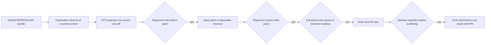

# Verified fix to GitHub pull request

This is a deliberately gated workflow. It starts only from an immutable bundle
whose verdict is `REPRODUCED`; it never edits the source checkout that was
investigated.



## Prepare, validate, and review locally

`prepare-pr` sends `store:false` with its model request. It accepts only the
first generated regression test from a signed `REPRODUCED` bundle. It copies
the supplied checkout to a temporary directory, verifies the regression fails
before the patch, applies the proposed source-only Git diff, verifies the same
test passes, and runs `pytest -q` in the existing restricted Docker policy.

It rejects malformed patches and changes to `.github`, `.git`, secrets,
credentials, environment files, or the generated regression test itself.

```powershell
python -m bugagent prepare-pr `
  --bundle .bugagent/runs/<run-id> `
  --repo C:\work\e-commerce `
  --repository the-fat-panda/e-commerce `
  --base backend-main `
  --image $env:BUGAGENT_SANDBOX_IMAGE
```

Success writes `.bugagent/prepared-prs/<run-id>.json`. The plan contains the
pinned base commit, patch, generated regression test, branch name, and draft
PR body. No GitHub API call, push, branch, or PR is made by `prepare-pr`.

## Publish only after explicit approval

The publishing command is intentionally unusable unless both are true:

1. `BUGAGENT_GITHUB_TOKEN` is set and is restricted to the configured
   `BUGAGENT_GITHUB_ALLOWED_REPOSITORIES`.
2. The operator has explicitly set `BUGAGENT_GITHUB_PR_PUBLISH_ENABLED=true`.

Only then can an operator run:

```powershell
python -m bugagent publish-pr --plan .bugagent/prepared-prs/<run-id>.json
```

Before pushing, the publisher clones the configured base branch again and
requires its resolved commit to equal the commit that was validated. It creates
a `devsleuth/fix-...` branch in that disposable clone, adds the source fix and
regression test, pushes that branch, and opens a **draft** pull request. A
changed base branch invalidates the plan rather than publishing stale evidence.

Jira does not invoke this flow automatically. In the workspace, a reproduced
GitHub-backed bundle exposes **Prepare local fix**; it requires an explicit
browser confirmation and starts the same local validation flow in a background
job. It still cannot publish. Automatic Jira fix jobs and the Jira PR backlink
remain separate follow-up work.
