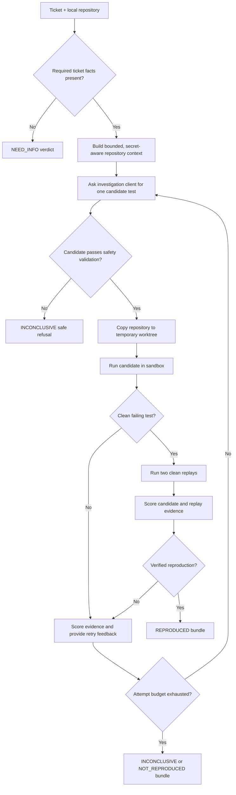

# Investigation workflow

## Status

Implemented locally. The caller provides a normalized `Ticket`, local repository path, and repository commit label. Jira intake is not yet the caller.

## Flow



## Code trace

1. [`Ticket.missing_information()`](../../bugagent/domain.py) describes mandatory investigation facts.
2. [`assess_ticket()`](../../bugagent/scoring.py) turns missing facts into a high-confidence `NEED_INFO` verdict before any sandbox work.
3. [`ReadOnlyRepository.build_context()`](../../bugagent/agent/repository.py) inventories Python files and bounded snippets while excluding `.git`, virtual environments, generated artifacts, and sensitive paths.
4. [`ResponsesInvestigationClient.propose()`](../../bugagent/agent/client.py) asks the Responses API for exactly one structured `CandidateTest`. `ScriptedInvestigationClient` replaces it in the repeatable local fixture.
5. [`validate_candidate()`](../../bugagent/agent/repository.py) enforces the generated-test path, size, pytest name, required hypothesis, and prohibited-operation rules.
6. [`InvestigationOrchestrator.investigate()`](../../bugagent/agent/orchestrator.py) is the controller. It allows at most three attempts, creates a temporary worktree, runs the candidate, runs two replays after a clean failure, and records timeline events.
7. [`assess_evidence()`](../../bugagent/scoring.py) decides the final deterministic verdict.

## Important behavior

- The agent cannot write to the source repository: candidate tests are written only into a temporary copy.
- The model does not decide whether reproduction succeeded; the deterministic verifier does.
- A candidate rejected by the safety validator is not run at all and becomes an `INCONCLUSIVE` safe refusal.
- A valid-looking failure remains `INCONCLUSIVE` until two replays agree.

## Entry point and proof

Run the complete scripted fixture with:

```powershell
python -m scripts.run_agent_checkpoint --image <immutable-image-id>
```

The checkpoint creates a signed proof bundle under `.bugagent/checkpoint-3/`.
