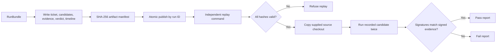

# Artifact and independent replay workflow

## Status

Implemented locally.

## Flow



## Code trace

1. [`ArtifactStore.write()`](../../bugagent/artifacts.py) serializes ticket, candidates, evidence, verdict, and timeline into a staging directory.
2. [`ArtifactStore._hash_artifacts()`](../../bugagent/artifacts.py) hashes each artifact with SHA-256. The final `manifest.json` includes these hashes, prompt version, repository label, and run ID.
3. The staging directory is atomically renamed to `.bugagent/<run-id>/`; the store refuses to overwrite an existing run ID.
4. [`load_verified_bundle()`](../../bugagent/replay.py) checks the manifest's exact expected artifact set and every hash before reading replay inputs.
5. [`replay_bundle()`](../../bugagent/replay.py) recreates the candidate in a temporary repository copy, executes it twice through the sandbox, and compares both observed signatures with the signed candidate signature.
6. [`bugagent replay`](../../bugagent/cli.py) prints a machine-readable report and exits non-zero if the result is not verified.

## What independent replay does and does not prove

It proves that a selected immutable bundle has not been altered and that its recorded test still produces the recorded normalized failure twice in fresh sandboxes against the supplied checkout. A full Git SHA stored in the bundle is checked against `git rev-parse HEAD`; fixture-style symbolic refs are surfaced as not Git-verifiable rather than guessed.

It does not contact Jira, push Git changes, or modify the supplied repository.

## Entry point and proof

```powershell
python -m bugagent replay --bundle .bugagent/checkpoint-3/<run-id> --repo <pinned-checkout> --image <immutable-image-id>
```

Tests in [`tests/test_replay.py`](../../tests/test_replay.py) cover hash tampering and confirm that replay leaves the input checkout untouched.
